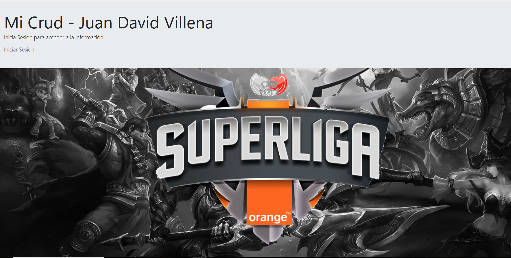
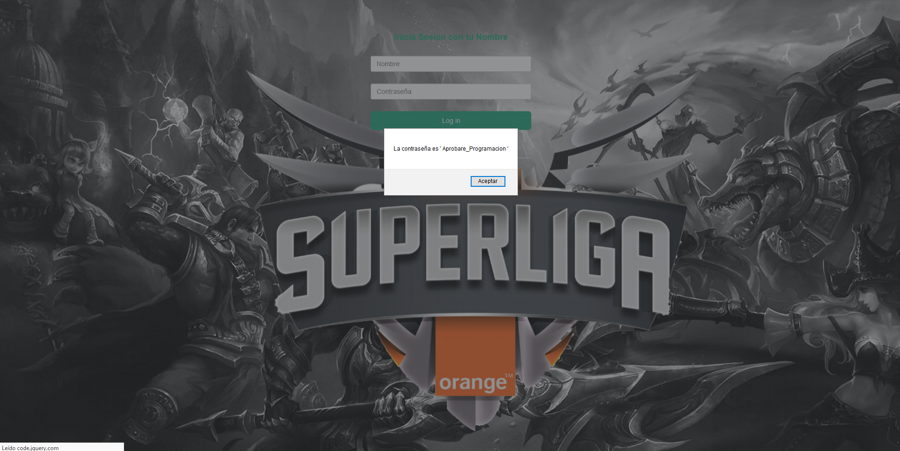
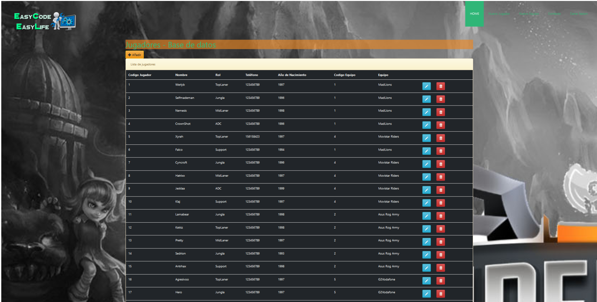
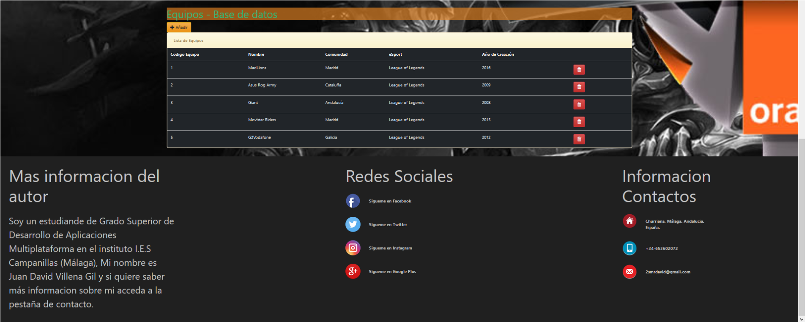
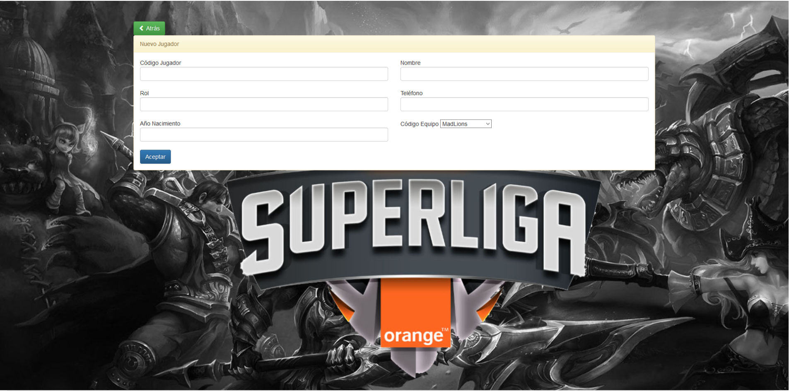
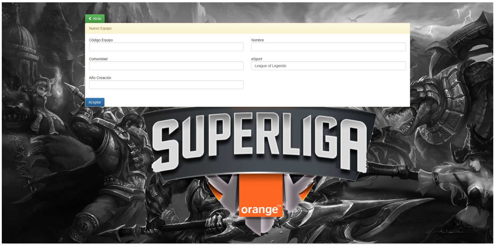
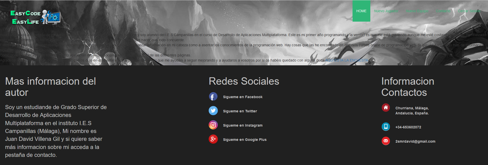

# crud-jsp
Trabajo DAM Final 2º Trimestre  
Soy Juan David Villena Gil y la temática de mi crud esta relacionada con un equipo de Esport como mi trabajo de ED.
En mi Crud se pueden administrar jugadores como sus equipos toda la informacion tanto de Nombres, Roles y Edad son verdaderas buscadas en internet. He realizado el estilo de mi página de dos maneras diferentes una general que ha sido con Boostrap y otra con un CSS propio.
<h1>INDEX.HTML</h1>

<h1>login.HTML</h1>

<h1>INDEX.jsp</h1>

<h1>Añadir Jugador.JSP</h1>

<h1>Añadir Equipo.JSP</h1>

<h1>Contacto.HTML</h1>

<h1>Cerrar Sesion</h1>

